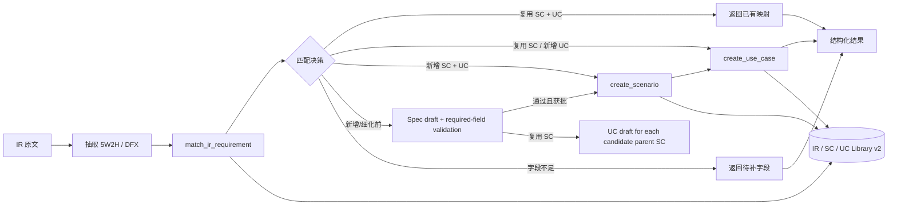

# IR Scenario Agent

一个面向 IR（Information Requirement）、场景 SC 和用例 UC 的轻量 Python agent。

它把“理解需求 → 检索场景库 → 判断是否复用 → 必要时新建场景 → 关联一个或多个 use case”拆成了可调用工具，方便后续替换存储、检索算法或加入多 agent 编排。

完整设计思路、匹配评分、Spec 校验和新增流程见：[IR → SC → UC Agent 设计说明](docs/ir-sc-uc-agent-design.md)。

## 当前能力

- 默认使用 OpenAI Responses API；也支持 `chat_completions` 模式接入 DeepSeek 等 OpenAI 兼容服务。
- 使用严格 JSON Schema 的 function tools：
  - `match_ir_requirement`：按 5W2H/DFX、Actor、生命周期、影响因素、约束和 UC 行为链匹配。
  - `match_scenario`：对单独输入的 SC 描述匹配场景库，返回候选、置信度和复用/新建建议。
  - `match_use_case`：对单独输入的 UC 行为链匹配 UC 库，可限定唯一父 SC。
  - `draft_scenario_from_ir`：按可加载业务 Spec 将 IR 映射成只读 SC 草稿并返回待补字段。
  - `draft_use_cases_from_ir`：从一个或多个候选 SC 派生只读 UC 草稿。
  - `save_ir_requirement` / `get_ir_requirement`：保存和读取结构化 IR。
  - `search_scenarios` / `get_scenario`：检索和读取场景。
  - `search_use_cases` / `get_use_case` / `list_use_cases`：检索和读取 UC。
  - `validate_library`：只读检查 IR/SC/UC 数量、重复 ID、SC→UC 引用、孤儿 UC、IR 追溯和 Spec 必填字段。
  - `create_scenario`：创建通过必填校验的场景草稿。
  - `create_use_case`：创建完整 UC 并自动挂到唯一父场景。
  - `link_scenario_use_cases`：把尚未归属的 UC 挂到一个场景；已归属其他场景的 UC 会被拒绝。
  - `update_scenario` / `update_use_case`：修改内容字段并递增 revision，已废弃记录不可直接覆盖。
  - `transition_record`：按 Draft → Inwork → Review → Publish → Obsolete 流转 SC/UC 状态。
  - `move_use_case`：迁移 UC 的唯一父 SC，并同步更新两侧 revision。
- 匹配结果区分四种决策：复用场景和 UC、复用场景但新增 UC、新增场景和 UC、信息不足待澄清。
- 完整 IR 匹配会返回候选分差和硬冲突；Actor、生命周期、影响部件或范围明确冲突，或最高/次高候选过于接近时，会转为人工澄清，避免误复用。
- 匹配保留中文单字、二/三字短语和 How Much/DFX 证据；Actor、上下文、影响因素等关键维度未覆盖时，即使总分较高也不会自动复用。
- 完整 IR 使用 `match_ir_requirement`；单独维护 SC/UC 时分别使用 `match_scenario`/`match_use_case`。独立匹配是只读建议，实际新建仍需调用对应写入工具并经过审批。
- 支持一个 IR 返回多个场景候选、一个 SC 关联多个 UC；每个 UC 只能归属一个父 SC。新增时按单个 SC/UC 草稿分别审批，避免把独立行为链强行合并。
- 使用 `config/ir_sc_uc_spec.json` 约束 IR→SC→UC 映射、场景类别/状态、六类影响因素维度和质量输出；不把 IR 直接当 SC。
- Spec 的 `matching` 段可配置复用阈值、候选歧义分差和领域同义词/冲突词；更换业务领域时优先改配置，不必修改匹配代码。
- 匹配默认使用关键词证据 + TF-IDF 的混合检索，并支持 Spec 同义词；设置 `IR_AGENT_EMBEDDING_MODEL` 后会叠加 OpenAI 兼容 Embedding，服务不可用时自动回退。
- 场景硬性校验 `description`、`category`、`business_goal`、`actor`、`actions`、`lifecycle`、`constraints`、`influence_factors`、`owner`；影响因素至少有一个选中值。
- UC 硬性校验前置条件、触发事件、成功/最小保证和主成功场景，拒绝写入空壳 UC。
- 支持项目级 Skill：从 `skills/**/SKILL.md` 自动发现、按需求选择，也可以由 agent 搜索/加载。
- 支持长期记忆：SQLite 按 `user_id` 隔离，提供 `search_memory` / `save_memory` 工具，并拒绝明显的密钥类内容。
- 支持远程 MCP：从 `config/mcp.json` 读取 MCP server，作为 Responses API 的 MCP tool 传给模型；支持工具白名单、认证字段和调用审批。
- 支持插件：从 `plugins/**/plugin.json` 动态加载可信本地 Python 插件，插件可以注册 function tools。
- agent 自己管理 Responses API 的工具调用循环，支持一轮返回多个工具调用。
- 本地工具、审批、审计和场景库逻辑与模型供应商解耦；Chat Completions 模式下远程 MCP 不启用，插件和本地 function tools 仍可用。
- 提供可选 Textual TUI：多行粘贴 IR/SC/UC、后台执行模型请求、显示匹配结果/工具调用，并支持写入与 MCP 授权弹窗。
- TUI 的 IR 文档和场景库读取在后台任务执行；切换场景库时会隔离旧会话上下文，结果 JSON 同时记录输入来源、SC/UC 库和 Spec 路径。
- Responses 模式使用严格 JSON Schema；Chat Completions 模式使用 JSON mode 并由 Pydantic 做最终校验，方便后续 Web/API 消费；CLI 默认把它渲染成人类可读摘要。
- 最终结构化结果会再次对照当前场景库和工具返回的真实 ID；如果模型输出了不存在或未由写入工具产生的 SC/UC 编号，会自动降级为待澄清，不把模型文本当成事实。
- 场景库和记忆写入工具默认需要应用层人工批准；批准、拒绝、耗时和结果会写入 JSONL 审计日志。
- API 临时失败支持指数退避重试；会话超过本地阈值时优先使用 `/responses/compact`，不可用时使用有界本地回退。
- 本地 JSON 场景库，开箱即用；后续可以替换成 PostgreSQL、向量数据库或企业知识库。
- 场景库也支持 SQLite：将 `IR_AGENT_LIBRARY_PATH` 或 `--library` 指向 `.sqlite3/.sqlite/.db` 即启用 WAL、事务写入和过期快照保护。
- 会话上下文可落盘到 `data/sessions/`，默认 `store=False`，不依赖服务端线程状态。
- 工具参数和领域对象使用 Pydantic 校验，减少模型生成脏数据的影响。

## 快速开始

建议使用 Python 3.11+。

```powershell
python -m venv .venv
.\.venv\Scripts\Activate.ps1
pip install -e ".[dev,docs,tui]"
Copy-Item .env.example .env
```

在 `.env` 中填入 `OPENAI_API_KEY`。模型可通过 `OPENAI_MODEL` 覆盖，默认是 `gpt-5.5`。

也可以使用其他 OpenAI 兼容 API。以 DeepSeek 为例：

```env
IR_AGENT_API_KEY=your-deepseek-key
IR_AGENT_API_MODE=chat_completions
IR_AGENT_BASE_URL=https://api.deepseek.com
IR_AGENT_MODEL=deepseek-v4-pro
```

`IR_AGENT_API_MODE=responses` 是默认模式；`chat_completions` 模式适用于提供 OpenAI Chat Completions 兼容接口的服务。不要把 `/chat/completions` 拼进 `IR_AGENT_BASE_URL`，客户端会自动追加路径。

常用运行配置：

```env
IR_AGENT_MAX_TOOL_ROUNDS=8
IR_AGENT_REQUEST_TIMEOUT=120
IR_AGENT_MAX_RETRIES=2
IR_AGENT_RETRY_BACKOFF=0.5
IR_AGENT_MAX_SESSION_ITEMS=100
IR_AGENT_MAX_CONTEXT_CHARS=120000
IR_AGENT_OUTPUT_DIR=data/outputs
IR_AGENT_API_MODE=responses
IR_AGENT_STRUCTURED_OUTPUT=true
IR_AGENT_REQUIRE_TOOL_APPROVAL=true
IR_AGENT_AUDIT_PATH=data/audit.jsonl
IR_AGENT_SPEC_PATH=config/ir_sc_uc_spec.json
IR_AGENT_EMBEDDING_MODEL=
IR_AGENT_API_TOKEN=
```

场景库支持三种存储方式：默认的 `data/scenario_library.json` 是 IR、SC、UC 单文件兼容模式；如果把 `IR_AGENT_LIBRARY_PATH` 配置为目录，例如 `data/scene_library`，Agent 会使用 `data/scene_library/scenarios.json` 和 `data/scene_library/uc/use_cases.json`；如果路径是 `.sqlite3/.sqlite/.db`，则启用 SQLite 事务库。也可以通过 `IR_AGENT_UC_LIBRARY_PATH` 或启动参数 `--uc-library` 单独指定 UC 库文件。

默认会加载：

- `skills/` 下的项目 Skill
- `plugins/` 下的可信插件
- `data/memory.sqlite3` 长期记忆
- `config/mcp.json` 中的 MCP server

启动交互式 agent：

```powershell
ir-agent
```

启动 TUI：

```powershell
ir-agent-tui
```

TUI 支持多行粘贴和文档启动：

```powershell
ir-agent-tui --ir-path .\examples\ir_sanitized.txt --library .\data\scenario_library.json
```

界面分为独立的输入区、Agent 输出区和运行状态区。左侧提供两个可编辑路径输入：

- `IR 文档路径`：支持 `.txt`、`.md`、`.json`、`.docx`、`.pdf`；
- `场景库路径`：可以填写单个 JSON 文件，也可以填写场景库目录。填写目录时自动使用目录下的 `scenarios.json` 和 `uc/use_cases.json`。

点击“读取 IR 并发送”后，程序会先校验两个路径、读取 IR，再用该场景库执行匹配；也可以继续直接粘贴文本并点击“发送”。输出区分为“对话”“候选对比”“工具日志”三个视图；“候选对比”分别展示 SC 表和按父 SC 过滤的 UC 表，包含名称、分数、命中维度、缺口和冲突，下方保留逐项解释。点击表格行后可以加入一个或多个 SC/UC，填充确认/编辑提示，或确认后继续发送；“检查库质量”按钮会直接触发只读审计。右侧显示本轮决策摘要，并提供打开结果文件/输出目录按钮。使用 `Ctrl+L` 清空输出显示，`Ctrl+Q` 退出。每轮结果会保存到 `IR_AGENT_OUTPUT_DIR/<session_id>/`，界面会显示绝对输出路径；当前生效的场景库、UC 库、Spec、输出目录和审计日志路径也会显示在右侧。TUI 默认仍会对场景库/记忆写入和 MCP 调用弹窗确认；本地调试时可使用 `--auto-approve-writes` 自动批准写入。

本地库检查和迁移不需要调用大模型：

```powershell
ir-agent --validate-library --library .\data\scenario_library.json
ir-agent --migrate-to-sqlite .\data\scenario_library.sqlite3 --library .\data\scenario_library.json
```

需要给其他系统调用时，可以安装可选 Web 依赖并启动 REST API：

```powershell
pip install -e ".[web]"
ir-agent-api --library .\data\scenario_library.sqlite3 --api-token "$env:IR_AGENT_API_TOKEN"
```

`GET /health`、`POST /match`、`GET /scenarios`、`GET /use-cases` 和 `POST /library/validate` 为查询接口；`POST /agent/run` 需要 API token。生产环境应放在 HTTPS 反向代理后，并设置 token、访问控制和日志脱敏。

也可以直接执行一次：

```powershell
ir-agent --message "请帮我找一个支持客服多轮知识库问答的场景，并说明它能覆盖哪些 use case"
```

如果要让脚本直接拿到严格 JSON 结果：

```powershell
ir-agent --message "匹配这个 IR 需求" --json-output
```

可以把脱敏后的整段 IR/SC/UC 文本直接粘贴到交互式 CLI。Agent 会先返回匹配决策和缺失字段；只有你明确要求保存或新增时才触发写入审批。

也可以直接读取文档。`.txt/.md/.json` 开箱即用；`.docx/.pdf` 使用 `docs` 可选依赖：

```powershell
ir-agent --input-file .\examples\ir_sanitized.txt --json-output
```

也可以指定另一份业务规范：

```powershell
ir-agent --input-file .\examples\ir_sanitized.txt --spec .\config\ir_sc_uc_spec.json --json-output
```

使用独立 UC 库：

```powershell
ir-agent --library .\data\scene_library --uc-library .\data\scene_library\uc\use_cases.json
```

### 为什么需要 Spec

这里有两层“spec”，不要混淆：

- 业务 Spec：`config/ir_sc_uc_spec.json`，规定 IR→SC→UC 的映射、SC/UC 必填字段、类别/状态、六类影响因素和识别视角；
- API 输出 Schema：`agent.py` 中的严格 JSON Schema，规定 Agent 最终返回给程序的格式。

实际流程不是“模型读完 IR 就直接生成场景”，而是：

`文档 → 5W2H/DFX 抽取 → 场景库确定性匹配 → Spec 校验/草稿 → 人工确认 → 写入 SC → 派生/写入 UC`

Spec 让字段和业务边界稳定，模型负责原文理解和语义判断，场景库负责事实匹配；因此责任人、影响因素值或 UC 最小保证缺失时，会返回待补清单，不会为了让流程看起来完整而编造。

创建新场景的示例：

```powershell
ir-agent --message "场景库里没有覆盖医疗知识库的多跳证据检索，请新建一个场景草稿，并关联所有相关 use case"
```

指定用户记忆空间或关闭长期记忆：

```powershell
ir-agent --user-id alice
ir-agent --no-memory
```

写入工具（保存 IR、新建场景、新建 UC、关联 UC、保存记忆）在交互式 CLI 中会询问确认；非交互模式默认拒绝。明确确认后可以使用 `--auto-approve-writes`，调试或兼容旧模型时可以使用 `--no-structured-output`。

### IR 匹配与新增规则

| 判断 | 结果 |
|---|---|
| 目标、Actor、生命周期、影响因素、约束一致，已有 UC 覆盖触发—处理—保证 | 复用 SC + UC |
| 场景边界一致，但新增了触发条件、处理分支或保证 | 复用 SC，新增 UC |
| Actor、生命周期、业务目标或影响因素不兼容 | 新增 SC，再新增 UC |
| IR 的 Who/When/Where/What/How/Why/How Much，或 SC/UC 必填项缺失 | 只返回待补字段，不写入 |

`data/scenario_library.json` 已包含脱敏的 `IR-XXXX-001`、`SCN-XXXX-001/002`、`UC-XXXX-001/002`，可以直接用于本地匹配测试。SC 通过 `use_case_ids` 维护其子 UC；新建 UC 时使用唯一的 `scenario_id` 指定父 SC。

### 配置 MCP

当前接入的是 Responses API 的远程 MCP 方式。Chat Completions 模式不发送远程 MCP 工具，但本地场景库工具、Skill、记忆和插件仍然可用。先将示例复制后填写可信服务地址：

```powershell
Copy-Item config/mcp.example.json config/mcp.local.json
```

然后设置：

```env
IR_AGENT_MCP_CONFIG=config/mcp.local.json
MCP_AUTH_TOKEN=your-token
```

`require_approval` 使用 `always` 时，交互式 CLI 会在调用前询问；非交互环境默认拒绝。当前版本不是本地 stdio MCP client，若你的 MCP server 只有本地进程协议，需要先提供可访问的 HTTP MCP endpoint。

### 编写插件

插件目录至少包含一个 `plugin.json` 和入口 Python 文件：

```json
{
  "name": "my-plugin",
  "version": "0.1.0",
  "description": "My tools",
  "entrypoint": "plugin.py:create_plugin",
  "enabled": true
}
```

入口函数接收 `PluginContext`，返回一个或多个 `ToolSpec`。可参考 `plugins/example/`。插件会执行本地 Python 代码，只加载你信任的插件。

运行测试：

```powershell
python -m unittest discover -s tests -v
```

## 设计



关键边界：模型负责理解和决策，场景库工具负责事实读取与写入。这样不会把场景库内容“凭空记在 prompt 里”，也方便日后接入真实数据源。

## 项目结构

```text
.
├── data/scenario_library.json  # IR / SC / UC v2 示例库
├── data/memory.sqlite3         # 运行后生成的长期记忆
├── config/mcp.json             # MCP 配置
├── config/ir_sc_uc_spec.json   # IR→SC→UC 业务 Spec
├── skills/                     # SKILL.md 工作流
├── plugins/                    # plugin.json + Python 插件
├── src/ir_agent/
│   ├── agent.py                # 双协议工具循环和会话状态
│   ├── api.py                  # 可选 REST API 与 token 保护
│   ├── audit.py                # JSONL 审计日志和敏感字段脱敏
│   ├── cli.py                  # 命令行入口
│   ├── config.py               # 环境变量配置
│   ├── documents.py            # txt/md/json/docx/pdf 文档适配器
│   ├── domain.py               # Pydantic 领域模型
│   ├── library.py              # JSON 场景库和原型检索
│   ├── memory.py               # SQLite 长期记忆
│   ├── mcp.py                  # 远程 MCP 配置
│   ├── plugins.py              # 插件发现和加载
│   ├── skills.py               # Skill 发现和选择
│   ├── specs.py                # 可加载业务 Spec、映射、草稿和校验
│   ├── tools.py                # 严格 schema 的 agent tools
│   └── tui.py                  # 可选 Textual TUI
└── tests/
```

## 后续演进建议

1. 把 `ScenarioLibrary.search()` 和 `MemoryStore.search()` 换成“关键词召回 + embedding 召回 + rerank”的混合检索，保留现在的接口。
2. 如果需要本地 stdio MCP，再接入 MCP Python SDK，并让插件/MCP 共用统一的工具权限层。
3. 当流程变成“需求澄清 agent → 检索 agent → 场景设计 agent → 评审 agent”时，再使用 Agents SDK 的 handoff 或 agents-as-tools 编排。
4. 增加 Web API/SSE、持久化数据库、插件隔离和更完整的评测/成本监控。

## 官方 API 依据

实现遵循 OpenAI 官方文档中的 Responses API、function calling 和 structured tool schema 方向：

- <https://platform.openai.com/docs/quickstart/make-your-first-api-request>
- <https://developers.openai.com/api/reference/python/resources/beta/subresources/responses>
