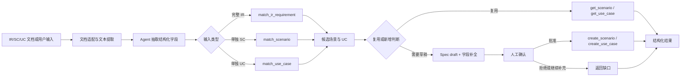

# IR → SC → UC Agent 设计说明

## 1. 文档目的

本文说明当前项目的设计思想，以及 Agent 如何完成：

`用户文档/IR → 信息抽取 → 场景匹配 → UC 匹配 → 复用或新增 → 审批写入`

当前版本重点解决的是需求分析和场景库治理问题，不是直接把一段 IR 原文“改名后当成 SC”。

## 2. 核心设计思想

### 2.1 模型负责理解，工具负责事实

Agent 采用“模型理解 + 确定性工具执行”的分层方式：

- 大模型：从自然语言或文档中抽取 5W2H、DFX，识别意图，解释匹配差异，决定下一步调用哪个工具。
- 场景库工具：读取真实的 IR、SC、UC，执行可重复的匹配、字段校验和写入。
- 业务 Spec：定义哪些字段必填、IR 如何映射到 SC、影响因素有哪些维度。
- 审批层：所有写入操作都需要用户明确同意，并记录审计日志。

这样做的好处是：模型可以理解复杂文本，但不能凭空编造场景编号、责任人或影响因素；匹配结果也可以重复验证。

### 2.2 IR、SC、UC 是三个不同层次

| 对象 | 关注点 | 典型内容 |
|---|---|---|
| IR | 为什么做、要解决什么问题 | 5W2H、约束、性能、可靠性、可服务性 |
| SC | 在什么上下文中发生什么活动 | Actor、Action、生命周期、影响因素、业务目标 |
| UC | 如何完成一条具体行为链 | 前置条件、触发事件、主成功场景、扩展场景、保证 |

关系是分层的一对多：

- 一个 IR 可以拆成多个 SC；
- 一个 SC 可以关联多个 UC；
- 一个 UC 是唯一父 SC 的子对象，不能被多个 SC 共享；
- IR、SC、UC 通过 `source_ir_ids` 和 SC 的 `use_case_ids` 保留追溯关系。

因此，IR 可以复用一个已有 SC，但新增一个不同的 UC；也可以因为 Actor、生命周期或影响因素不兼容而新建 SC。

## 3. 整体架构



当前场景库默认是 JSON 文件，也支持把 SC 和 UC 拆成：

```text
场景库根目录/
├── scenarios.json
└── uc/
    └── use_cases.json
```

后续可以替换成数据库、全文检索引擎或向量数据库，而不改变 Agent 的工具契约。

## 4. 输入和 Spec

### 4.1 IR 输入

Agent 会尝试抽取：

- `code`、`title`、`description`、`source`、`owner`；
- `who`、`when`、`where`、`what`、`how`、`why`、`how_much`；
- `constraints`；
- 性能、可靠性、可服务性、可维护性、可销售性、交付时间和标签。

对于完整 IR，`who/when/where/what/how/why/how_much` 是匹配所需的核心字段。缺失时，Agent 返回 `needs_clarification`，不会直接新建。

### 4.2 SC 必填字段

当前业务 Spec `config/ir_sc_uc_spec.json` 要求 SC 至少包含：

`description`、`category`、`business_goal`、`actor`、`actions`、`influence_factors`、`lifecycle`、`constraints`、`owner`。

每个影响因素还必须有：

`name`、`kind`、`dimension`、至少一个 `selected_values`。

影响因素按两类、六个维度组织：

- 环境因子：硬件环境、组网场景、协议连接；
- 活动因子：存储架构、业务场景、运维场景。

### 4.3 UC 必填字段

当前 UC 至少包含：

`description`、`actor`、`preconditions`、`trigger_event`、`success_guarantee`、`minimum_guarantee`、`main_success_scenario`。

UC 不是只有一个名称。至少需要描述一条“触发 → 处理步骤 → 成功保证”的行为链。

### 4.4 Spec 的作用

`config/ir_sc_uc_spec.json` 不是大模型提示词的替代品，而是业务约束和校验依据，主要负责：

1. 规定 IR→SC 的字段映射；
2. 规定 IR→SC、SC→UC 的关系基数，其中 UC 必须有唯一父 SC；
3. 规定 SC/UC 的硬性必填字段；
4. 规定场景类别和工作流状态；
5. 规定影响因素维度及示例值；
6. 提供六个场景识别视角：人机交互、设备交互、系统外部接口、系统边界、运维场景、周边设备/工具；
7. 防止把模块直接当成场景，或把 IR 原文直接当成 SC；
8. 在 `matching` 段配置复用阈值、歧义分差和领域词表，驱动确定性匹配器的冲突判断。

匹配配置示例：

```json
{
  "matching": {
    "scenario_reuse_threshold": 0.45,
    "scenario_strong_threshold": 0.70,
    "use_case_reuse_threshold": 0.45,
    "ambiguity_margin": 0.08,
    "critical_dimensions_for_reuse": ["Actor", "上下文", "影响因素"],
    "actor_categories": {"system": ["本系统", "控制器"]}
  }
}
```

未填写或填写非法的阈值会回退到默认值；领域词表为空或格式不正确时，也会回退到内置基础词表。`critical_dimensions_for_reuse` 中的维度如果没有被候选覆盖，即使总分较高，也只返回 `needs_clarification`，不会自动复用。

## 5. 如何匹配

### 5.1 完整 IR 的匹配入口

完整 IR 必须优先调用：

```text
match_ir_requirement
```

它会同时匹配 SC 和 UC，并返回：

- `scenario_matches`：候选 SC、分数、命中词、命中维度、未覆盖维度；
- `use_case_matches`：选中候选 SC 的子 UC、分数、命中词；如果没有 SC 候选，才回退到全库 UC 候选；
- `decision`：复用/新增/待澄清；
- `confidence`：最高候选 SC 分数；
- `score_margin`：最高和次高 SC 候选的分差；
- `ambiguous`：候选是否过于接近；
- `rationale`：决策原因。

### 5.2 IR→SC 的匹配维度

完整 IR 的 SC 匹配不是只比较标题，而是按以下维度计算：

| 维度 | 权重 | 主要来源 |
|---|---:|---|
| 目标/行为意图 | 0.55 | title、description、what、why、how 与 SC 名称、描述、目标、动作、标签 |
| Actor | 0.15 | IR 的 who 与 SC actor |
| 生命周期/上下文 | 0.10 | when、where 与 SC lifecycle、描述、影响部件 |
| 影响因素 | 0.10 | where、description、constraints、how_much 与影响因素、部件 |
| 约束 | 0.10 | IR constraints/how_much 与 SC constraints |

计算后，如果多个维度同时命中，会额外增加少量一致性分，最终分数限制在 `0~1`。

中文检索同时保留单字、二字和三字短语证据：单字保证旧库召回，短语让“知识库”“异常检测”等连续表达比零散同字更有权重。这是一种可解释的确定性匹配：系统能说明命中了“目标/行为、Actor、上下文、影响因素”中的哪些维度，而不是只返回一个无法解释的向量距离。

### 5.3 独立 SC 匹配

如果用户只输入一段 SC 描述，调用：

```text
match_scenario
```

它会在 SC 的名称、描述、业务目标、意图、动作和标签中进行轻量文本检索，并返回：

```json
{
  "decision": "reuse_existing",
  "confidence": 0.82,
  "reuse_threshold": 0.45,
  "matches": [],
  "rationale": []
}
```

独立 SC 匹配的 `decision` 只有两种：

- `reuse_existing`：最高候选达到复用阈值；
- `create_new`：没有候选达到复用阈值。

它是“是否值得继续复用”的建议，不等于已经写入场景库。

### 5.4 UC 匹配

UC 有两种入口：

- `search_use_cases`：只返回原始候选列表；
- `match_use_case`：返回候选并给出复用/新建建议。

`match_use_case` 的查询内容会覆盖 UC 的：

`name`、`description`、`actor`、`preconditions`、`trigger_event`、成功/最小保证、主成功场景、扩展场景、约束、DFX 和标签。

它还支持传入唯一父场景 `scenario_id`：

```json
{
  "query": "用户提交问题，召回证据并生成可追溯回答",
  "scenario_id": "scn_enterprise_knowledge_qa",
  "top_k": 5,
  "min_score": 0.0
}
```

传入 `null` 表示在整个 UC 库中匹配；传入 SC ID 后，只匹配这个 SC 已关联的 UC。这样可以避免从全库选到语义相近、但不属于当前场景的 UC。

### 5.5 当前匹配阈值和决策

完整 IR 的默认决策规则如下：

| 条件 | 决策 |
|---|---|
| IR 核心字段缺失 | `needs_clarification` |
| 最高 SC 分数 `< 0.45` | `create_scenario_and_uc` |
| Actor、生命周期、影响部件或范围出现明确硬冲突 | `needs_clarification` |
| 最高候选与次高候选分差 `< 0.08`，且最高分达到复用线 | `needs_clarification` |
| SC 分数达到复用线，但没有覆盖行为链的子 UC | `reuse_scenario_create_uc` |
| SC 分数 `≥ 0.70`，且父 SC 子 UC 分数 `≥ 0.45` | `reuse_scenario_and_uc` |

这里的分数是当前轻量检索器的匹配置信号，不是统计学概率，也不是最终业务结论。硬冲突和关键维度缺口检查优先于分数；候选分差过小时不自动复用。阈值和领域词表由 `config/ir_sc_uc_spec.json` 的 `matching` 段控制，后续仍可以把召回层替换为 BM25、Embedding、Reranker 或企业检索服务。

## 6. 如何从 IR 生成 SC 和 UC

### 6.1 IR 到 SC 的字段映射

当前 Spec 的主要映射如下：

| IR 字段 | SC 字段 | 处理方式 |
|---|---|---|
| Who | Actor | 直接映射并校验是否为空 |
| When | 生命周期 | 作为场景发生的运行上下文 |
| Where | 影响因素、影响部件 | 优先识别硬件/组网/协议等维度 |
| What + How | 业务目标、Action | 形成场景目标和活动列表 |
| How Much | 约束、DFX | 形成数量、性能、可靠性、服务性要求 |
| Restrict | 约束 | 与 How Much 合并去重 |
| Why | 场景意图 | 用于匹配和解释场景价值 |

影响因素的推导只使用 Spec 中的维度和输入文本证据：

- 文本命中“接口卡、节点、部件、修复、隔离、告警”等词时，形成相应候选维度；
- `where` 有值但没有命中示例时，会将原始 Where 作为待确认的硬件环境值；
- 不会因为库里存在“类型 A”就自动把 IR 中的“某部件”补成“类型 A”。

### 6.2 草稿优先

需要新建时，先走只读草稿工具：

```text
draft_scenario_from_ir
draft_use_cases_from_ir
```

草稿工具会返回：

- 推导出的字段；
- 当前 Spec 映射；
- 缺失的必填字段；
- 识别视角和质量输出。

草稿不写入库。用户可以补充责任人、类别、影响因素具体值、UC 成功保证等字段后再提交。

### 6.3 新建 SC

当匹配结果是 `create_scenario_and_uc`，或用户明确要求新建时：

1. 根据 IR 和 Spec 生成 SC 草稿；
2. 检查 SC 必填字段和影响因素选中值；
3. 用户确认或审批；
4. 调用 `create_scenario` 写入；
5. 系统生成 `SCN-DRAFT-XXXXXXXX` 形式的 ID；
6. 以新建的 SC ID 作为唯一父场景，再创建其子 UC。

`create_scenario` 还会检查：

- 场景名称不能重复；
- 类别、工作流状态符合当前 Spec；
- 必填字段和影响因素结构完整。

### 6.4 新建 UC

当场景边界可以复用，但行为链不同，使用：

```text
draft_use_cases_from_ir
→ 用户补充/确认
→ create_use_case
```

新 UC 必须至少包含：

- Actor；
- 前置条件；
- 触发事件；
- 主成功场景步骤；
- 成功保证；
- 最小保证。

创建时必须提供唯一的 `scenario_id`，系统会：

1. 生成 `UC-DRAFT-XXXXXXXX` 形式的 ID；
2. 写入 UC 库；
3. 自动把 UC ID 加入该父 SC 的 `use_case_ids`。

如果需要关联已有 UC，`link_scenario_use_cases` 只接受尚未归属的 UC；已归属其他 SC 的 UC 会报错，避免形成多父关系。移动 UC 需要后续提供专门的迁移操作，不会被当前工具静默执行。

## 7. 以异常检测 IR 为例

你提供的 IR 可以抽取为：

```text
Who: 本系统
When: 系统正常运行时，某部件出现异常
Where: 系统的某部件
What: 改进某指令异常检测机制
How: 检测复位/校验错误/数据不一致；复位修复；下电隔离；恢复节点
Why: 当前检测机制无法覆盖全部异常
How Much: 每月处理限制、告警、阈值可调、性能无影响
Constraints: 只监控 IO 进程；事后检测；数据修复不在范围；可能误判
```

匹配时会重点检查：

1. 目标是否都是“异常检测和隔离”；
2. Actor 是否都是“本系统”；
3. 生命周期是否都是“正常服务”；
4. 影响部件是否都是相同类型的硬件/节点；
5. 约束是否一致，例如只监控 IO 进程、事后检测、误判风险；
6. 已有 UC 是否覆盖“发现异常 → 排除软件干扰 → 修复/恢复/隔离 → 告警”的完整链路。

因此可能出现两类结果：

- 如果场景上下文和约束一致，但已有 UC 只有“指令异常检测”而没有“单节点 IO 进程反复 core”这条行为链：复用 SC，新增 UC；
- 如果部件类型、生命周期、Actor 或影响因素完全不同：新增 SC，再新增 UC。

这里“复用 SC、增加 UC”是有意的拆分：SC 表示稳定的业务/系统上下文，UC 表示该 SC 下的具体行为分支。UC 不能被其他 SC 共享；如果另一场景需要类似行为，应创建该场景自己的 UC。

## 8. 写入、审批和追溯

以下工具会修改数据，默认需要应用层审批：

- `save_ir_requirement`；
- `create_scenario`；
- `create_use_case`；
- `link_scenario_use_cases`；
- `save_memory`。

匹配、查询和草稿工具是只读的。拒绝审批时不会修改场景库；批准、拒绝、耗时和结果会写入审计日志。

写入后的追溯关系包括：

- SC 的 `source_ir_ids` 指向来源 IR；
- SC 的 `use_case_ids` 指向其子 UC；
- UC 的 `source_ir_ids` 指向来源 IR；
- UC 创建请求的 `scenario_id` 指定唯一父 SC，并在写入时建立 SC→UC 关联。

## 9. 当前实现的边界

当前版本已经具备可用的端到端骨架，但匹配器仍是轻量、可解释的文本检索：

- 中文主要按词/字符进行匹配，同义词和隐含语义覆盖有限；
- Spec 中的 0.45、0.70 和 0.08 等阈值是工程启发式，不代表概率；
- 硬冲突检查依赖当前 Spec/领域词表，未知同义词仍需要人工确认；
- Agent 会返回建议，但不能代替领域专家确认场景边界和责任人；
- 独立 SC/UC 匹配是只读建议，若要新建仍需提供完整字段并审批；
- 会话会记录当前场景库、UC 库和 Spec 上下文，切换已知库时会清理旧历史，避免跨库污染；
- 当前没有直接同步到 PLM、需求管理平台或企业主数据系统。

因此，当前版本适合先完成“字段规范化、候选复用、缺口识别、人工审批和追溯”闭环。

## 10. 推荐的后续演进

建议按以下顺序增强：

1. **混合检索**：关键词/BM25 负责可解释召回，Embedding 负责同义语义召回，Reranker 负责最终排序；
2. **分层阈值**：进一步按场景类别、业务域和库规模设置不同复用阈值；
3. **重复和冲突检测**：扩展当前 Spec 词表，识别名称不同但行为、Actor、影响因素高度重复的 SC/UC；
4. **人工反馈闭环**：记录“采纳/拒绝/修改候选”，用于优化排序和提示；
5. **关系图谱**：将 IR、SC、UC、功能、SR 和影响因素形成可追溯图；
6. **企业系统适配器**：把本地 JSON 工具替换为 PLM、需求管理系统或数据库连接器。

## 11. 相关代码入口

- Agent 规则和工具循环：[src/ir_agent/agent.py](../src/ir_agent/agent.py)
- 场景/UC 数据结构：[src/ir_agent/domain.py](../src/ir_agent/domain.py)
- 确定性匹配和写入：[src/ir_agent/library.py](../src/ir_agent/library.py)
- 工具定义、参数校验和审批标记：[src/ir_agent/tools.py](../src/ir_agent/tools.py)
- 业务 Spec：[config/ir_sc_uc_spec.json](../config/ir_sc_uc_spec.json)
- 示例库：[data/scenario_library.json](../data/scenario_library.json)
